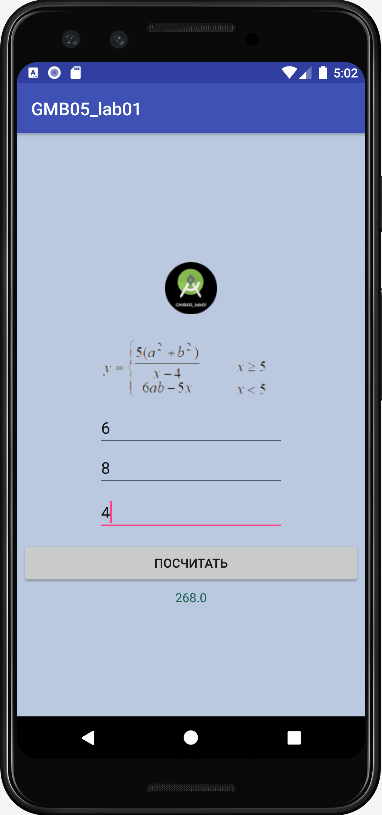

# GMB05_lab01_AndroidStudio
Practical work 1. In the discipline of Mobile application development



```
if (x >= 5){
    y = (5 * (Math.pow(a,2) + Math.pow(b,2)))/ x - 4;
}
else{
    y = 6 * a * b - 5 * x;
}
if (!(Double.isNaN(y)) && (!Double.isInfinite(y)) // Проверка существования значений
        ) {
    textView_sum.setText(String.valueOf(y));
} else {
    textView_sum.setText("Нет решения!"); // Нет решения
}
```

Teacher: https://github.com/proffix4
